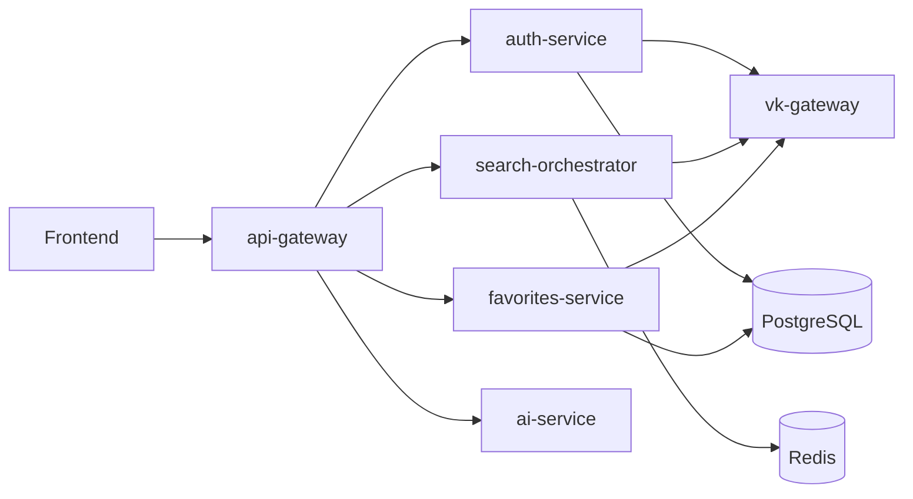

# FindNMeet Backend Architecture

## Overview

FindNMeet backend is a pnpm workspace with service packages under `services/*` and shared TypeScript packages under `packages/*`.

The project is a microservice-oriented backend for VK-based people search, authentication, favorites, AI features, and API composition. Service maturity is uneven: `auth-service` and `favorites-service` already contain gRPC application logic, persistence, and domain modules, while some other services are still closer to bootstrap-level implementations.

Important current auth docs:

- `docs/superpowers/specs/2026-05-03-auth-favorites-domain-and-contracts.md`
- `docs/superpowers/specs/2026-05-15-vk-id-web-auth-and-vk-credential-lifecycle-design.md`
- `docs/frontend-vk-web-auth-api.md`

## Workspace Layout

```text
.
├── services/
│   ├── api-gateway/
│   ├── auth-service/
│   ├── search-orchestrator/
│   ├── favorites-service/
│   ├── ai-service/
│   └── vk-gateway/
├── packages/
│   ├── types/
│   ├── ts-types/
│   └── utils/
├── docs/
│   └── superpowers/specs/
├── docker-compose.yml
├── package.json
├── pnpm-workspace.yaml
└── tsconfig.json
```

`pnpm-workspace.yaml` includes:

- `services/*`
- `packages/*`

## Runtime Components



The diagram reflects the intended service boundaries from the repository names, environment variables, and domain spec. In the current implementation, `auth-service` and `favorites-service` already own their domain logic behind gRPC transports, while `search-orchestrator`, `ai-service`, and `vk-gateway` are still comparatively thin.

## Services

### `services/api-gateway`

NestJS HTTP service that acts as the public API entry point and thin transport proxy to internal gRPC services.

Current files:

- `src/app.module.ts` wires `AuthModule`, `ProxyModule`, and `HealthController`.
- `src/health/health.controller.ts` exposes `GET /health`.
- `src/main.ts` starts an HTTP Nest application, sets global prefix `/api/v1`, enables CORS, validation, and cookie parsing.
- `src/proxy/*` contains the thin route-to-gRPC dispatch layer.
- `src/config/gateway.config.ts` defines the public HTTP surface and cookie behavior.

Scripts:

- `build`: `nest build`
- `dev`: `nest start --watch`
- `start:prod`: `node dist/main`
- `test`: `jest`

Important current public auth routes:

- `POST /api/v1/auth/complete-vk-web-auth`
- `POST /api/v1/auth/complete-vk-oauth`
- `POST /api/v1/auth/get-user`
- `POST /api/v1/auth/refresh-session`
- `POST /api/v1/auth/revoke-session`

Session delivery is cookie-based:

- access cookie: `fm_access_token`
- refresh cookie: `fm_refresh_token`

Frontend clients must send requests with credentials enabled.

### `services/auth-service`

NestJS service for authentication.

Current files:

- `src/app.module.ts` wires `AuthModule`, TypeORM, and `AuthGrpcController`.
- `src/index.ts` starts a Nest gRPC microservice.
- `src/auth/*` contains application, domain, persistence, VK integration, and security logic.
- `src/interfaces/grpc/controllers/auth-grpc.controller.ts` exposes auth RPC methods including:
  - backend-side OAuth code completion;
  - frontend-token-based VK Web auth completion;
  - user lookup;
  - external link lookup;
  - session refresh and revoke.

Default port:

- `AUTH_SERVICE_PORT=3001`

Current implemented responsibility:

- local user creation and lookup for VK-linked identities;
- persistence of `User`, `UserExternalLink`, `AuthToken`, and `AuthSession`;
- issuing local FindNMeet access and refresh tokens;
- accepting frontend VK Web auth payload and verifying it through `vk-gateway`;
- storing VK credentials in encrypted form;
- exposing session refresh and revoke flows.

Current note:

- local session refresh is implemented;
- server-side VK credential refresh contract exists, but the actual VK refresh call is not implemented yet in `vk-gateway`.

### `services/search-orchestrator`

Express service intended to orchestrate search flows.

Current files:

- `src/app.ts` creates an Express app with JSON middleware and `GET /health`.
- `src/index.ts` starts the server.
- `src/app.spec.ts` tests the health response.

Default port:

- `SEARCH_ORCHESTRATOR_PORT=3002`

Expected boundary:

- Search request composition.
- Calls to `vk-gateway` for VK people/profile data.
- Possible Redis usage for caching or coordination.

### `services/favorites-service`

NestJS gRPC service that owns favorites.

Current files:

- `src/app.module.ts` wires `FavoritesModule`, TypeORM, and `FavoritesGrpcController`.
- `src/index.ts` starts a Nest gRPC microservice.
- `src/favorites/*` contains application, domain, and persistence logic for favorites.
- `src/grpc/controllers/favorites-grpc.controller.ts` exposes favorites RPC methods for create, get, list, update, delete, and refresh.

Default port:

- `FAVORITES_SERVICE_PORT=3003`

Target responsibility from the domain spec:

- CRUD for saved external profiles.
- VK profile snapshot enrichment through `vk-gateway`.
- Persistence of generic favorites plus VK-specific snapshot fields.

### `services/ai-service`

Express service intended for AI-assisted features.

Current files:

- `src/app.ts` creates an Express app with JSON middleware and `GET /health`.
- `src/index.ts` starts the server.
- `src/app.spec.ts` tests the health response.

Default port:

- `AI_SERVICE_PORT=3004`

Expected boundary:

- Features that depend on `OPENAI_API_KEY`.
- AI-specific orchestration kept outside gateway and domain services.

### `services/vk-gateway`

Go service that isolates VK API access.

Current files:

- `cmd/server/main.go` starts the gRPC server plus an HTTP health endpoint.
- `internal/vkgateway/*` contains gRPC transport and service orchestration.
- `internal/vkapi/*` contains direct VK API HTTP client logic.
- `cmd/server/main_test.go` and `internal/vkgateway/service_test.go` cover health and gRPC behavior.
- `go.mod` declares module `github.com/findnmeet/vk-gateway` with Go 1.21.

Default port:

- `VK_GATEWAY_PORT=8080`

Current implemented responsibility:

- VK OAuth code exchange;
- VK profile lookup by explicit lookup + access token;
- current-user VK profile verification by access token for frontend-token-based Web auth;
- gRPC adapter shielding TypeScript services from VK API details.

Current note:

- `RefreshOAuthTokens` RPC is present in the contract, but backend refresh logic is still a stub in `internal/vkapi/client.go`.

## Shared Packages

### `packages/types`

Legacy or simple shared TypeScript package named `@findnmeet/types`.

Current export:

- `ServiceHealthResponse`

### `packages/ts-types`

Generated/protobuf-oriented TypeScript contract package, also named `@findnmeet/types`.

Current exports:

- `ServiceHealthResponse`
- `shared/v1`
- `vk/v1`
- `auth/v1`
- `search/v1`
- `favorites/v1`
- `ai/v1`

The package expects generated files under `packages/ts-types/.gen/*` and has scripts:

- `generate`: `pnpm --dir ../.. exec buf generate`
- `prebuild`: clean plus generate
- `build`: `tsc`

Proto sources live under `contracts/proto/*/v1`, and `buf.gen.yaml` generates TypeScript files into `packages/ts-types/.gen`.

### `packages/utils`

Shared utility package named `@findnmeet/utils`.

Current export:

- `buildHealthResponse(service: string): ServiceHealthResponse`

Used by all TypeScript services for health responses.

Current note: `packages/utils` currently builds with local `src -> dist` layout and is used by TypeScript services for health payloads.

## Contracts And Domain Model

The main domain design currently lives in:

- `docs/superpowers/specs/2026-05-03-auth-favorites-domain-and-contracts.md`

Important domain concepts:

- `User`
- `UserExternalLink`
- `AuthToken`
- `Favorite`
- `VkProfileSnapshot`
- `Provider`
- `VkRelationStatus`

Important constraints:

- External links are unique by `(provider, external_id)`.
- Favorites are unique by `(user_id, provider, external_id)`.
- A VK favorite must have one VK profile snapshot.
- VK dictionary-like values are stored as external ids plus display snapshots, not normalized local dictionaries.

## Infrastructure

`docker-compose.yml` starts local infrastructure:

- PostgreSQL 16 on `localhost:5432`
- Redis 7 on `localhost:6379`

`.env.example` defines:

- `POSTGRES_URL`
- `REDIS_URL`
- VK app and OAuth-related settings
- `OPENAI_API_KEY`
- JWT settings
- token encryption key
- service ports

Important current auth/VK-related env values:

- `VK_APP_ID`
- `VK_APP_SECRET`
- `VK_REDIRECT_URI`
- `VK_API_VERSION`
- `VK_OAUTH_URL`
- `VK_API_URL`
- `TOKEN_ENCRYPTION_KEY`
- `USER_JWT_PRIVATE_KEY`
- `USER_JWT_PUBLIC_KEY`
- `USER_JWT_EXPIRES_IN`
- `USER_REFRESH_EXPIRES_IN`

## Development Commands

Root scripts:

- `pnpm dev:gateway`
- `pnpm dev:auth`
- `pnpm dev:search`
- `pnpm dev:favorites`
- `pnpm dev:ai`
- `pnpm infra:up`
- `pnpm infra:down`

Service-level TypeScript scripts generally include:

- `dev`
- `build`
- `start:prod`
- `test`

Go service tests are run from `services/vk-gateway` with:

```sh
go test ./...
```

## Current Architectural State

Implemented:

- Monorepo structure.
- `api-gateway` as a running HTTP public edge with `/api/v1` prefix, cookie-based auth handling, and thin proxy routing.
- `auth-service` gRPC flows with TypeORM-backed persistence, VK gateway integration, local session handling, and frontend-token-based VK Web auth completion.
- `favorites-service` gRPC CRUD flows with TypeORM-backed persistence and domain logic.
- `vk-gateway` gRPC surface for OAuth code exchange, current-profile verification by VK access token, and explicit profile lookup.
- Shared packages for contracts and utilities.
- Local PostgreSQL and Redis compose file.
- Auth/favorites domain and VK Web auth documentation.

Planned or partially wired:

- server-side VK credential refresh through `vk-gateway`;
- search orchestration;
- AI-backed features.

Known inconsistencies to resolve:
- `.env.example` still contains some older VK naming/history and should be kept aligned with actual runtime usage.
- VK Web auth is implemented for login completion, but automatic VK token refresh is not finished yet.

1. Domain Layer (Центр. Святая святых)
О чем может знать:

О своих собственных абстракциях: Entity, Value Object, Aggregate.

О других элементах своего же слоя (Order знает об OrderItem).

Об интерфейсах (портах), которые определяет сам же домен (например, OrderRepository, PaymentGateway).

О базовых типах языка (строки, числа, списки, Optional, Result).

О чем НЕ может знать (запрещено категорически):

О базе данных: Никаких @Entity, @Table, ActiveRecord, SQL-запросов.

О фреймворках: Никаких импортов из Spring, ASP.NET, Gin.

О транспорте: Никаких аннотаций @GetMapping или protobuf-типов.

О слое Application: Домен не знает, кто и зачем его вызывает (HTTP-запрос, консольная команда или тест).

О слое Infrastructure: Домен определяет интерфейс репозитория, но не знает, кто и как его реализует (Postgres, MongoDB, Mock).

Простая проверка: Могу ли я взять папку domain/ и скомпилировать/запустить тесты без единой зависимости от БД, веб-сервера и внешних библиотек? Если да — всё чисто.

2. Application Layer (Средний слой. Дирижер)
Этот слой тоньше, чем кажется. Он не содержит бизнес-логики, он только координирует её выполнение.

О чем может знать:

О слое Domain: Импортирует сущности, агрегаты, доменные сервисы, интерфейсы репозиториев.

О своих собственных абстракциях: UseCase, Command, Query, DTO (специфичные для приложения, не для БД!).

Об интерфейсах (портах), которые нужны ему для работы (например, NotificationService, LoggingService).

О чем НЕ может знать:

О слоях Infrastructure и Interfaces (транспорт): Он понятия не имеет, как именно доставляется сообщение. Он просто вызывает метод интерфейса EmailSender.Send(...). Кто реализует — SMTP, SendGrid, сохранение в файл — ему безразлично.

О деталях UI/API: Он не знает, что команда "Оформить заказ" пришла по HTTP или gRPC. Он получает уже готовый объект PlaceOrderCommand.

Мнемоника: Application Layer — это "переводчик" и "менеджер". Он переводит команду извне в вызов домена (cmd -> order.Place()), вызывает домен, а потом, возможно, дергает порт (notification.Notify(...)). Он управляет транзакцией (если нужно), но не бизнес-правилами.

3. Infrastructure Layer (Внешний слой. Исполнитель)
Это "грязный" слой, и это нормально. Он слуга двух господ: он реализует интерфейсы, определенные в Domain и Application, и при этом знает о внешнем мире.

О чем может знать:

О слоях Domain и Application: Чтобы реализовать их интерфейсы, он должен их видеть.

PostgresOrderRepository реализует domain.OrderRepository.

SmtpEmailSender реализует application.EmailSender.

О конкретных технологиях: Драйверы БД, ORM (Hibernate, Entity Framework), HTTP-клиенты, SDK облачных сервисов, RabbitMQ/Kafka клиенты.

О своих ORM-сущностях или DTO для внешних API (например, OrderTable, SendGridRequest).

О чем НЕ может знать:

О слое Interfaces (транспорт): Репозиторий не знает и не должен знать, кто его вызвал — REST-контроллер или gRPC-сервис. Он просто предоставляет методы для сохранения и загрузки.

Важный нюанс: В этом слое живет маппинг. PostgresOrderRepository знает, как разобрать доменный Order (из слоя Domain) на поля таблицы orders в БД, и собрать обратно. Домен об этом маппинге не знает.

4. Interfaces / Presentation Layer (Самый внешний слой. Транспорт)
Здесь находятся "адаптеры" для взаимодействия с конкретными технологиями ввода-вывода.

О чем может знать:

О слое Application: Чтобы преобразовать HTTP-запрос или gRPC-сообщение в Command/Query и передать его в Application Service.

О своей технологии: HTTP-фреймворк, аннотации @PostMapping, protobuf-классы, gRPC-сервер.

О чем НЕ может знать:

О слоях Domain и Infrastructure напрямую: Контроллер не должен напрямую обращаться к БД или к доменным сервисам.

Плохо: orderController.Create(...) -> внутри лезет в БД и меняет статус заказа.

Хорошо: orderController.Create(...) -> создает CreateOrderCommand -> вызывает application.OrderService.Create(cmd) -> а уже сервис работает с репозиторием и доменом.
