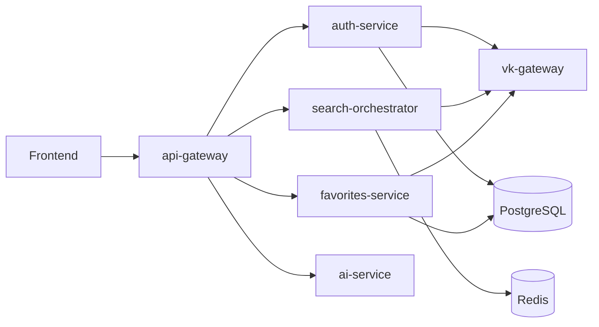

# FindNMeet Backend Architecture

## Overview

FindNMeet backend is a pnpm workspace with service packages under `services/*` and shared TypeScript packages under `packages/*`.

The project is currently a microservice-oriented backend skeleton for VK-based people search, authentication, favorites, AI features, and API composition. Most implemented service code exposes health checks; the broader domain model and auth/favorites target contracts are documented in `docs/superpowers/specs/2026-05-03-auth-favorites-domain-and-contracts.md`.

## Workspace Layout

```text
.
├── services/
│   ├── api-gateway/
│   ├── auth-service/
│   ├── search-orchestrator/
│   ├── favorites-service/
│   ├── ai-service/
│   └── vk-gateway/
├── packages/
│   ├── types/
│   ├── ts-types/
│   └── utils/
├── docs/
│   └── superpowers/specs/
├── docker-compose.yml
├── package.json
├── pnpm-workspace.yaml
└── tsconfig.json
```

`pnpm-workspace.yaml` includes:

- `services/*`
- `packages/*`

## Runtime Components



The diagram reflects the intended service boundaries from the repository names, environment variables, and domain spec. The current implementation mainly contains service bootstrap code and `/health` endpoints.

## Services

### `services/api-gateway`

NestJS service intended to be the public API entry point.

Current files:

- `src/app.module.ts` registers `HealthController`.
- `src/health/health.controller.ts` exposes `GET /health`.
- `src/main.ts` creates a Nest TCP microservice on `127.0.0.1:8888`.

Scripts:

- `build`: `nest build`
- `dev`: `nest start --watch`
- `start:prod`: `node dist/main`
- `test`: `jest`

Default environment variable from `.env.example` suggests an HTTP gateway port:

- `API_GATEWAY_PORT=3000`

Current note: `main.ts` does not start an HTTP Nest application, while tests instantiate an HTTP app and verify `GET /health`.

### `services/auth-service`

NestJS service for authentication.

Current files:

- `src/app.module.ts` registers `HealthController`.
- `src/health/health.controller.ts` exposes `GET /health`.
- `src/main.ts` starts an HTTP Nest app.

Default port:

- `AUTH_SERVICE_PORT=3001`

Target responsibility from the domain spec:

- VK OAuth callback handling.
- User and external identity persistence.
- Auth token storage and refresh metadata.
- Session or user-token issuance for API Gateway.

### `services/search-orchestrator`

Express service intended to orchestrate search flows.

Current files:

- `src/app.ts` creates an Express app with JSON middleware and `GET /health`.
- `src/index.ts` starts the server.
- `src/app.spec.ts` tests the health response.

Default port:

- `SEARCH_ORCHESTRATOR_PORT=3002`

Expected boundary:

- Search request composition.
- Calls to `vk-gateway` for VK people/profile data.
- Possible Redis usage for caching or coordination.

### `services/favorites-service`

Express service intended to own favorites.

Current files:

- `src/app.ts` creates an Express app with JSON middleware and `GET /health`.
- `src/index.ts` starts the server.
- `src/app.spec.ts` tests the health response.

Default port:

- `FAVORITES_SERVICE_PORT=3003`

Target responsibility from the domain spec:

- CRUD for saved external profiles.
- VK profile snapshot enrichment through `vk-gateway`.
- Persistence of generic favorites plus VK-specific snapshot fields.

### `services/ai-service`

Express service intended for AI-assisted features.

Current files:

- `src/app.ts` creates an Express app with JSON middleware and `GET /health`.
- `src/index.ts` starts the server.
- `src/app.spec.ts` tests the health response.

Default port:

- `AI_SERVICE_PORT=3004`

Expected boundary:

- Features that depend on `OPENAI_API_KEY`.
- AI-specific orchestration kept outside gateway and domain services.

### `services/vk-gateway`

Go service that isolates VK API access.

Current files:

- `cmd/server/main.go` starts an HTTP server with `GET /health`.
- `cmd/server/main_test.go` tests the health handler.
- `go.mod` declares module `github.com/findnmeet/vk-gateway` with Go 1.21.

Default port:

- `VK_GATEWAY_PORT=8080`

Target responsibility from the domain spec:

- VK OAuth token exchange.
- VK user info/profile lookup.
- Shield other services from VK API details.

## Shared Packages

### `packages/types`

Legacy or simple shared TypeScript package named `@findnmeet/types`.

Current export:

- `ServiceHealthResponse`

### `packages/ts-types`

Generated/protobuf-oriented TypeScript contract package, also named `@findnmeet/types`.

Current exports:

- `ServiceHealthResponse`
- `shared/v1`
- `vk/v1`
- `auth/v1`
- `search/v1`
- `favorites/v1`
- `ai/v1`

The package expects generated files under `packages/ts-types/.gen/*` and has scripts:

- `generate`: `pnpm --dir ../.. exec buf generate`
- `prebuild`: clean plus generate
- `build`: `tsc`

Proto sources live under `contracts/proto/*/v1`, and `buf.gen.yaml` generates TypeScript files into `packages/ts-types/.gen`.

### `packages/utils`

Shared utility package named `@findnmeet/utils`.

Current export:

- `buildHealthResponse(service: string): ServiceHealthResponse`

Used by all TypeScript services for health responses.

Current note: `packages/utils/tsconfig.json` points `rootDir` and `outDir` to `../ts-utils/*`, while the actual package directory is `packages/utils`. Package manifests and some Jest mappings also mention `ts-utils`, so this area needs cleanup before relying on package builds.

## Contracts And Domain Model

The main domain design currently lives in:

- `docs/superpowers/specs/2026-05-03-auth-favorites-domain-and-contracts.md`

Important domain concepts:

- `User`
- `UserExternalLink`
- `AuthToken`
- `Favorite`
- `VkProfileSnapshot`
- `Provider`
- `VkRelationStatus`

Important constraints:

- External links are unique by `(provider, external_id)`.
- Favorites are unique by `(user_id, provider, external_id)`.
- A VK favorite must have one VK profile snapshot.
- VK dictionary-like values are stored as external ids plus display snapshots, not normalized local dictionaries.

## Infrastructure

`docker-compose.yml` starts local infrastructure:

- PostgreSQL 16 on `localhost:5432`
- Redis 7 on `localhost:6379`

`.env.example` defines:

- `POSTGRES_URL`
- `REDIS_URL`
- VK OAuth settings
- `OPENAI_API_KEY`
- JWT settings
- token encryption key
- service ports

## Development Commands

Root scripts:

- `pnpm dev:gateway`
- `pnpm dev:auth`
- `pnpm dev:search`
- `pnpm dev:favorites`
- `pnpm dev:ai`
- `pnpm infra:up`
- `pnpm infra:down`

Service-level TypeScript scripts generally include:

- `dev`
- `build`
- `start:prod`
- `test`

Go service tests are run from `services/vk-gateway` with:

```sh
go test ./...
```

## Current Architectural State

Implemented:

- Monorepo structure.
- Basic TypeScript and Go service skeletons.
- Health endpoints and tests for each service type.
- Shared health response utility.
- Local PostgreSQL and Redis compose file.
- Draft auth/favorites domain and API contract documentation.

Planned or partially wired:

- API Gateway as public HTTP entry point.
- VK OAuth and profile integration.
- Persistence for auth and favorites.
- Search orchestration.
- AI-backed features.

Known inconsistencies to resolve:
- `packages/utils/tsconfig.json` references `../ts-utils`, which is not a workspace package directory.
- `api-gateway/src/main.ts` starts a TCP microservice but does not call `listen()` and does not match the HTTP health check used by tests.
