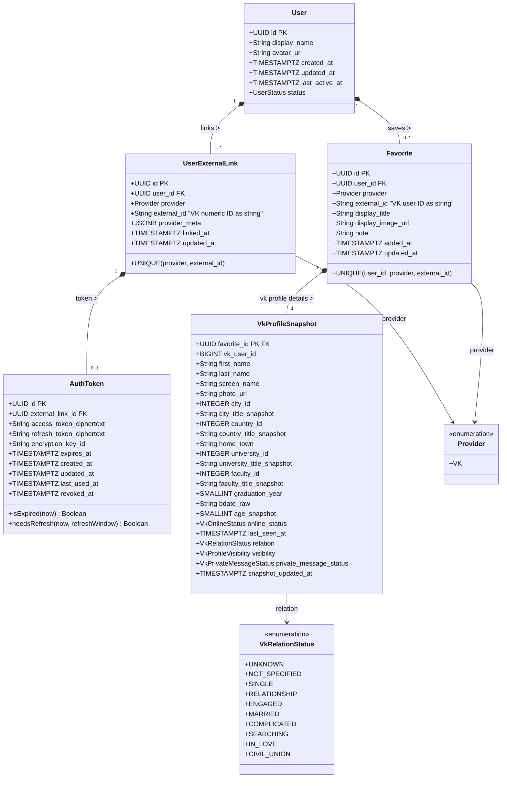
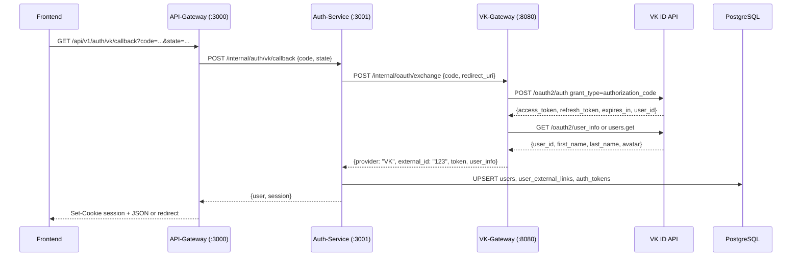
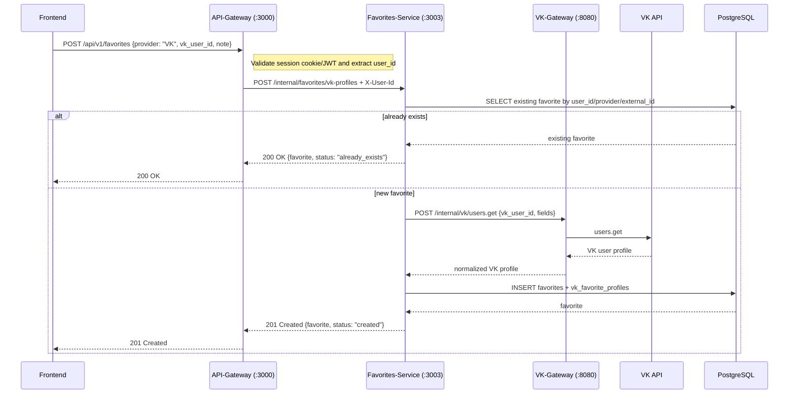
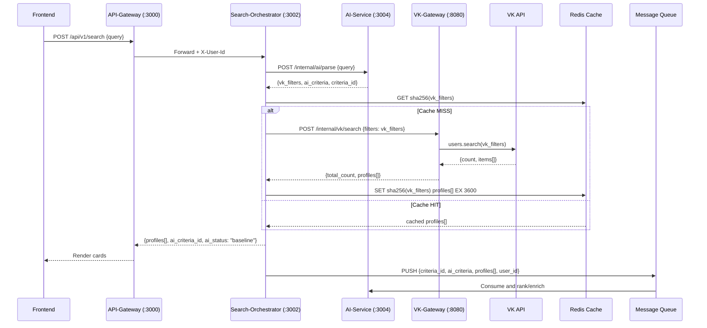

# Auth And Favorites Domain Contracts

**Date:** 2026-05-03
**Status:** Draft

---

## Context

FindNMeet currently searches only VK people profiles. Favorites are therefore modeled as a generic saved external object plus a VK-specific profile snapshot. The generic part is intentionally small and stable; VK-only profile data stays in the VK detail table and proto message.

The model does not introduce separate city, country, university, or faculty entities. VK owns these dictionaries. We store VK reference ids for matching/filtering and title snapshots for display.

---

## Database Class Diagram



---

## Database Constraints

- `user_external_links.provider + user_external_links.external_id` is globally unique.
- `auth_tokens.external_link_id` is unique when the system stores only the current provider token.
- `favorites.user_id + favorites.provider + favorites.external_id` is unique.
- `vk_favorite_profiles.favorite_id` is both PK and FK to `favorites.id`.
- `vk_favorite_profiles.vk_user_id` is not globally unique because different users can favorite the same VK profile.
- For `Favorite.provider = VK`, exactly one VK profile snapshot must exist.

---

## Snapshot Rules

- `favorites.display_title` is derived from VK `first_name + last_name`.
- `favorites.display_image_url` uses the best available VK photo URL.
- VK reference-like fields are persisted as flat columns: `{field}_id` plus `{field}_title_snapshot`.
- API/DTO contracts expose these fields as `VkReference { id, title }`.
- `raw_payload` is intentionally not stored by default to avoid retaining unnecessary personal data.
- VK privacy and messaging state use explicit enums in API/DTO contracts so the
  contract can evolve beyond boolean open/closed states.

---

## HTTP API Schemas

These are external API Gateway contracts. Proto files remain the source of truth for internal generated service contracts.

### Auth

Endpoint:

```http
GET /api/v1/auth/vk/callback?code={code}&state={state}
```

Request query:

```json
{
  "code": "a1b2c3...",
  "state": "csrf_token"
}
```

Response:

```json
{
  "success": true,
  "user": {
    "id": "550e8400-e29b-41d4-a716-446655440000",
    "display_name": "Иван Иванов",
    "avatar_url": "https://...",
    "auth_result": "created_user"
  }
}
```

Header:

```http
Set-Cookie: session=eyJhbG...; Path=/; HttpOnly; Secure; SameSite=Strict
```

Sequence:



### Favorites

Endpoints:

- `POST /api/v1/favorites`
- `GET /api/v1/favorites?page_size=20&page_token=...`
- `GET /api/v1/favorites/{id}`
- `PATCH /api/v1/favorites/{id}`
- `DELETE /api/v1/favorites/{id}`
- `POST /api/v1/favorites/{id}/refresh`

Create request:

```json
{
  "provider": "VK",
  "vk_user_id": 123456789,
  "note": ""
}
```

Frontend must not be the source of truth for `display_title`, photos, city, age, or relation. Favorites-Service enriches the VK snapshot through VK-Gateway. If the UI sends a search-card snapshot later, treat it only as an optional hint, not trusted persistence data.

Create response:

```json
{
  "favorite": {
    "id": "8f7a9b0c-0000-4000-8000-000000000000",
    "provider": "VK",
    "external_id": "123456789",
    "display_title": "Анна Иванова",
    "display_image_url": "https://sun9-74.userapi.com/...",
    "note": "",
    "added_at": "2026-05-03T14:30:00Z",
    "updated_at": "2026-05-03T14:30:00Z",
    "vk_profile": {
      "vk_user_id": 123456789,
      "first_name": "Анна",
      "last_name": "Иванова",
      "screen_name": "anna",
      "photo_url": "https://sun9-74.userapi.com/...",
      "city": {
        "id": 1,
        "title": "Москва"
      },
      "country": {
        "id": 1,
        "title": "Россия"
      },
      "home_town": "Москва",
      "university": {
        "id": 123,
        "title": "МГУ"
      },
      "faculty": {
        "id": 456,
        "title": "ВМК"
      },
      "graduation_year": 2020,
      "bdate_raw": "01.02.1998",
      "age": 28,
      "online": false,
      "last_seen_at": "2026-05-03T12:00:00Z",
      "relation": "VK_RELATION_STATUS_SINGLE",
      "is_closed": false,
      "snapshot_updated_at": "2026-05-03T14:30:00Z"
    }
  },
  "status": "created"
}
```

For an existing favorite, API Gateway may return `200 OK` with the same shape and `status: "already_exists"`. Internal gRPC should use `ALREADY_EXISTS` when the caller specifically needs conflict semantics.

List response:

```json
{
  "favorites": [
    {
      "id": "8f7a9b0c-0000-4000-8000-000000000000",
      "provider": "VK",
      "external_id": "123456789",
      "display_title": "Анна Иванова",
      "display_image_url": "https://sun9-74.userapi.com/...",
      "note": "",
      "added_at": "2026-05-03T14:30:00Z",
      "updated_at": "2026-05-03T14:30:00Z"
    }
  ],
  "next_page_token": ""
}
```

List returns summary cards by default. `GET /api/v1/favorites/{id}` returns the full `vk_profile`.

Sequence:



### Search

Endpoint:

```http
POST /api/v1/search
```

Request:

```json
{
  "query": "высокие брюнеты из питера, любят рок"
}
```

Response:

```json
{
  "total_count": 142,
  "profiles": [
    {
      "provider": "VK",
      "external_id": "123456",
      "display_title": "Алексей Петров",
      "display_image_url": "https://...",
      "vk_profile": {
        "vk_user_id": 123456,
        "first_name": "Алексей",
        "last_name": "Петров",
        "screen_name": "alex",
        "photo_url": "https://...",
        "city": {
          "id": 2,
          "title": "Санкт-Петербург"
        },
        "country": {
          "id": 1,
          "title": "Россия"
        },
        "home_town": "Санкт-Петербург",
        "university": null,
        "faculty": null,
        "graduation_year": null,
        "bdate_raw": "12.04.1996",
        "age": 29,
        "online": false,
        "last_seen_at": null,
        "relation": "VK_RELATION_STATUS_NOT_SPECIFIED",
        "is_closed": false
      }
    }
  ],
  "ai_criteria_id": "a1b2c3d4-e5f6-7890-abcd-ef1234567890",
  "ai_status": "baseline"
}
```

Search profiles and favorite details intentionally share the same VK-profile DTO shape. This lets the frontend create a favorite with only `vk_user_id` while displaying the same card fields.

Internal AI parse contract:

```http
POST /internal/ai/parse
```

Request:

```json
{
  "query": "высокие брюнеты из питера, любят рок"
}
```

Response:

```json
{
  "vk_filters": {
    "q": "брюнет",
    "city": 2,
    "age_from": 25,
    "age_to": 35,
    "has_photo": 1
  },
  "ai_criteria": {
    "height_cm_min": 175,
    "interests": ["rock", "music"],
    "exclude_keywords": ["свадьба", "семья"]
  },
  "criteria_id": "a1b2c3d4-e5f6-7890-abcd-ef1234567890",
  "parsed_at": "2026-05-03T12:00:00Z"
}
```

Sequence:



---

## Proto Contracts

The source of truth for generated contracts is under:

- `contracts/proto/findnmeet/shared/v1`
- `contracts/proto/findnmeet/auth/v1`
- `contracts/proto/findnmeet/vk/v1`
- `contracts/proto/findnmeet/favorites/v1`
- `contracts/proto/findnmeet/search/v1`
- `contracts/proto/findnmeet/ai/v1`

Design choices:

- UUIDs are encoded as canonical RFC 4122 strings for JSON-friendly gateways.
- `Provider` lives in `findnmeet.shared.v1` to avoid redefining provider enums
  per service.
- `findnmeet.vk.v1.VkProfile` is the neutral VK profile DTO used by VK gateway
  and search results.
- `Favorite.provider_details` uses `oneof` with
  `findnmeet.favorites.v1.VkFavoriteSnapshot`. This keeps favorite-specific
  snapshot data out of the neutral VK profile DTO.
- RPC methods use response wrapper messages, following Buf STANDARD lint rules.
- `UpdateFavoriteRequest` uses `FavoritePatch` plus
  `google.protobuf.FieldMask` to restrict mutable fields.
- Provider tokens are internal persistence details and are not exposed through public service contracts.

Expected gRPC status mapping:

- duplicate favorite: `ALREADY_EXISTS`
- invalid UUID, page size, or VK user id: `INVALID_ARGUMENT`
- unauthenticated request: `UNAUTHENTICATED`
- access to another user's favorite: `PERMISSION_DENIED`
- missing favorite: `NOT_FOUND`
- VK profile temporarily unavailable during refresh: `UNAVAILABLE`
- VK profile exists but cannot be refreshed because of privacy/state: `FAILED_PRECONDITION`
